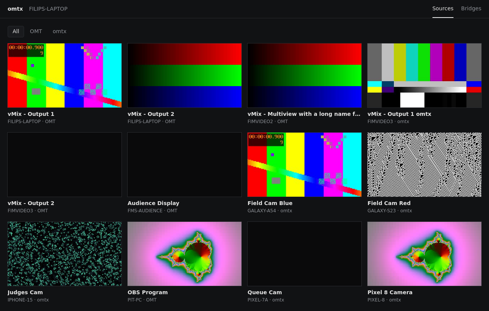
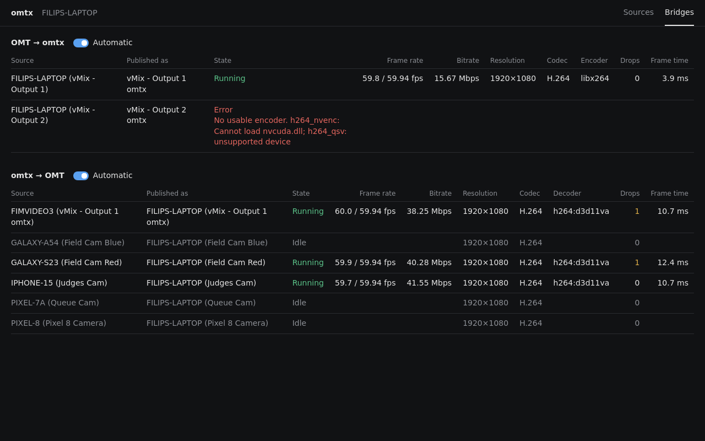

# omtx

[Open Media Transport](https://github.com/openmediatransport) with H.264 and HEVC instead of VMX.

OMT is easy to use: sources find each other on the network, and there's nothing to set up.
Its VMX codec needs 80+ Mbps for 1080p60, though. That's fine on a wired network and useless
on venue Wi-Fi. omtx keeps everything else about OMT (TCP framing, tally, metadata, mDNS
discovery) and sends long-GOP H.264 or HEVC instead.

It was built for an FRC event setup: vMix program out to projector PCs over Wi-Fi, and phones
as wireless cameras into vMix.

## What's here

| Path | |
|---|---|
| `tools/omtx/` | The `omtx` command line tool and the `omtx ui` web page (C#, FFmpeg loaded at runtime) |
| `libomtnet/` | Fork of upstream libomtnet with the H.264/HEVC additions |
| `android/` | Phone camera app |
| `docs/PROTOCOL-OMTX.md` | Wire format: what omtx adds to OMT 1.0 |
| `build/` | Docker build for Linux and Windows |

## Use

### vMix PC

Turn on OMT for the outputs you want in vMix (Settings > Outputs / NDI / SRT). Then run
`omtx-ui.cmd`. That's it.

- Every OMT output on the PC shows up on the network as an omtx source, e.g.
  `VMIXPC (vMix - Output 1 omtx)`.
- Every omtx source on the network (phones) shows up in vMix under Add Input > OMT, e.g.
  `VMIXPC (Pixel 9 Pro Camera)`. vMix tally goes back to the phone.
- A bridge only does work while something is watching it.
- The browser page at `http://localhost:6390` shows every source with a preview and stats.




Windows Firewall asks once for `omtx.exe`. Allow it on private networks.

### Phone

Install `omtx-camera.apk`, name the source and press Start. It has front and rear camera,
pinch zoom across all lenses, tap to focus, focus and exposure lock, exposure compensation,
a grid and tally. The encoder only runs while a receiver is connected.

### Projector or any Linux PC

Debian 11 or newer with `ffmpeg` and `libavahi-client3` installed:

```
./omtx list
./omtx play "VMIXPC (vMix - Output 1 omtx)"
```

`play` runs fullscreen (`--window 960x540+0+0` for a window). It decodes on the GPU when it
can and draws each frame as soon as it's decoded.

## How it behaves on a bad network

- Keyframes are sent on request only: when a receiver joins, or after it lost a frame. No
  periodic keyframes, no bitrate spikes.
- Frames wait in a short queue (up to 250 ms) when the link stalls, instead of being dropped.
  Past that, the sender drops to the next keyframe on that one connection.
- The bitrate is uncapped. It only steps down when frames get dropped, and climbs back
  within seconds.

## Latency

1080p60, measured with `omtx bars` (a test pattern with a clock in the picture) and
`omtx probe`:

| Path | p50 |
|---|---|
| Test pattern to another PC, stock OMT | 21 ms |
| Through vMix, stock OMT out | 82 ms |
| Through vMix, omtx out | 91 ms |
| Through vMix, omtx out, on screen | 121 ms |

Most of it is vMix: about 60 ms from input to output. omtx itself adds about 9 ms.

## Status

Tested on real hardware: a Windows laptop with vMix and an AMD GPU, a Pixel 9 Pro, mDNS on
Windows and Linux. Not tested yet: NVENC on an NVIDIA card, a real projector PC over
Wi-Fi. FFmpeg's AMD encoder is slow at 1080p60 (about 30 fps), so on AMD machines omtx
uses x264.

## Build

```
DOCKER_BUILDKIT=1 docker build -f build/Dockerfile --output type=local,dest=dist .
cd android && ./build.sh
```

`tests/run.sh` runs the regression tests in Docker.

## License

`libomtnet/` is MIT, from upstream (see `libomtnet/LICENSE.txt`).
